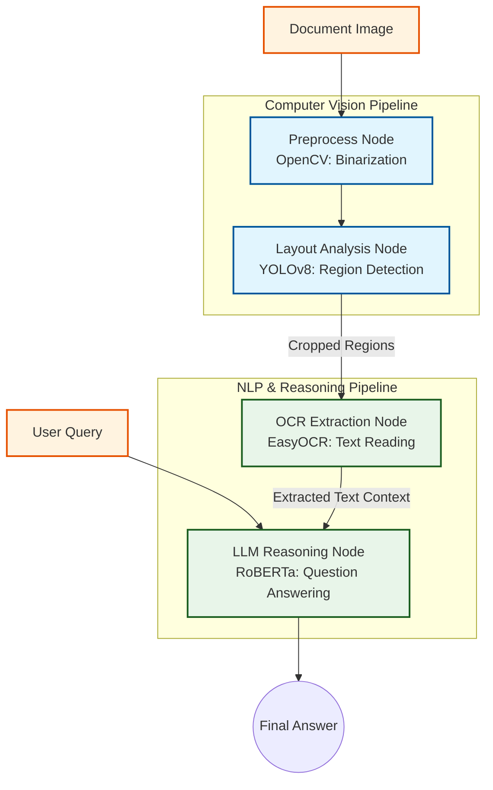

# Multimodal Document AI Agent 📄🔍

An end-to-end, stateful AI agent designed to bridge Computer Vision and Natural Language Processing. Built with **LangGraph**, this production-grade pipeline autonomously processes raw, noisy document images, extracts structural layouts, reads text, and applies LLM reasoning to answer user queries accurately.

## 🚀 Key Features

*   **Vision Preprocessing:** Utilizes **OpenCV** (Adaptive Thresholding, Grayscale conversion) to clean document images and mitigate real-world physical anomalies like shadows and noise.
*   **Intelligent Layout Analysis:** Employs **YOLOv8** to detect and isolate structural document regions. It implements a custom spatial sorting algorithm to arrange visual bounding boxes into a semantic reading order.
*   **OCR Extraction:** Digitizes text from the cropped visual regions using EasyOCR, effectively converting unstructured visual data into structured textual context.
*   **LLM Reasoning:** Integrates a pre-trained RoBERTa model via Hugging Face `transformers` to perform context-aware Question Answering (QA).
*   **Agentic Orchestration:** Manages the entire multi-step pipeline using **LangGraph**, ensuring a modular, highly scalable, and stateful architecture suitable for production environments.

## 🧠 System Architecture



## 🛠️ Tech Stack

*   **Computer Vision:** OpenCV, Ultralytics (YOLO)
*   **NLP & OCR:** Hugging Face, EasyOCR
*   **Orchestration:** LangGraph
*   **Core:** Python, PyTorch

## 💻 Quick Start

### Prerequisites
```bash
pip install langgraph langchain easyocr ultralytics opencv-python transformers
